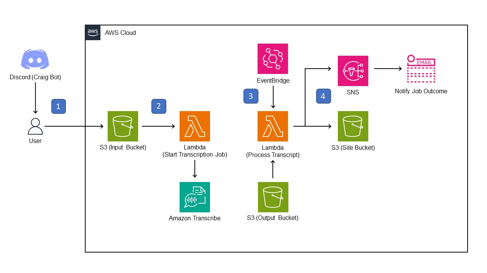

# Discord WordCloud

* [About This Project](#about-this-project)
    * [How is this project built?](#how-is-this-project-built)
    * [Solution Architecture](#solution-architecture)
* [Getting Started](#getting-started)
    * [Prerequisites](#prerequisites)
    * [Deployment](#deployment)
* [Usage](#usage)
* [License](#license)
* [Contact](#contact)

# About This Project

This project aims to quantify and visualize the frequency of specific words that are said during a Discord call.

This is achieved by transcribing a Discord call recording into text, and generating a word cloud from the transcript for visualization purposes. 
The word cloud and its associated metrics will then be hosted on a static webpage for viewing.

## How is this project built?

This project is built entirely on the Cloud, using Amazon Web Services (AWS). Amazon Transcribe, a speech transcribing service, serves as the backbone of this project. The backend for this project is hosted on AWS Lambda, and the frontend is hosted on AWS S3.

The project was developed using these tools:

## Solution Architecture

1. User will trigger Craig Bot on Discord to initiate a recording of the call. After the recording is stopped, Craig Bot will output a FLAC audio recording of the call session. User will manually upload this FLAC audio recording to the Input S3 bucket.
2. FLAC file upload in S3 triggers a Lambda function to initiate the transcription job on Amazon Transcribe using the FLAC file as input. Job parameters have already been pre-configured in the Lambda function.
3. Upon completion of the transcription job, a custom Event rule on EventBridge will trigger another Lambda function to process the transcript (retrieved from Output S3 bucket).
4. Processed transcript data (word cloud and metrics) will be uploaded to a static webpage hosted in S3. An SNS email notification will be sent to the user to notify them of the job outcome. The user can then view the word cloud on the static S3 webpage.

# Getting Started

## Prerequisites

- User must have access to an AWS account.
- User must invite [Craig Bot](https://craig.chat/) to their Discord server. 

## Deployment

Solution is deployed via Terraform. 
_WIP - Work on TF template, and include steps for manual non-pipeline TF deployment._

# Usage

_WIP - List steps to take as an end user to trigger the solution. Do after TF deployment is settled._

# License

Distributed under the MIT License. Refer to `LICENSE` for more details.

# Contact

Owner/Creator: **Yi Hao, Wong**

