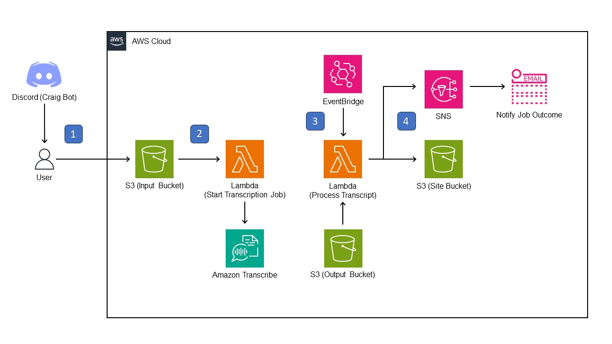

# Discord Chat Heatmap (Word Cloud)

* [About This Project](#about-this-project)
    * [How is this project built?](#how-is-this-project-built)
    * [Solution Architecture](#solution-architecture)
* [Getting Started](#getting-started)
* [Usage](#usage)
* [License](#license)
* [Contact](#contact)

# About This Project

This project aims to transcribe Discord chat sessions from chat participants (speech-to-text). This text will be processed into a word heatmap/word cloud for visualization purposes.
The visualization tool is hosted on a static webpage for easy access via the internet.

## How is this project built?

This project is built entirely on the Cloud, using Amazon Web Services (AWS). Amazon Transcribe, a speech transcribing service, serves as the backbone of this project. The backend for this project is hosted on AWS Lambda and AWS S3.

The project was developed using these tools:

## Solution Architecture

1. User will trigger Craig Bot on Discord. Craig Bot will output a FLAC audio recording of the chat session. User uploads this FLAC audio recording to the Input S3 bucket.
2. FLAC file upload in S3 triggers a Lambda function to initiate the transcription job on Amazon Transcribe. Job parameters are pre-configured via the Lambda function.
3. Upon completion of the transcription job, a custom Event rule on EventBridge will trigger a Lambda function to process the transcript (retrieved from Output S3 bucket).
4. Processed transcript data will be sent to a static webpage hosted in S3. An SNS email notification will be sent to the user to notify them of the job outcome.

# Getting Started

## Prerequisites

- User must have access to an AWS account.
- User must invite [Craig Bot](https://craig.chat/) to their Discord server. 

## Deployment

Solution can be deployed using CloudFormation. 
_WIP - Include CFN template for deployment._

# Usage

_WIP - List steps to take as an end user to trigger the solution._

# License

Distributed under the MIT License. Refer to `LICENSE` for more details.

# Contact

Owner/Creator: **Yi Hao, Wong**

